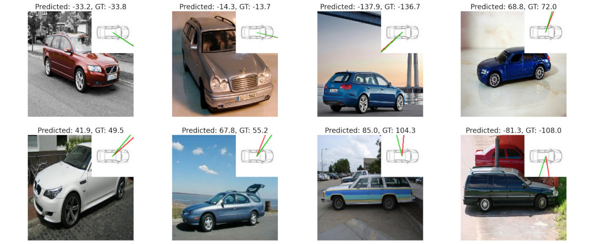
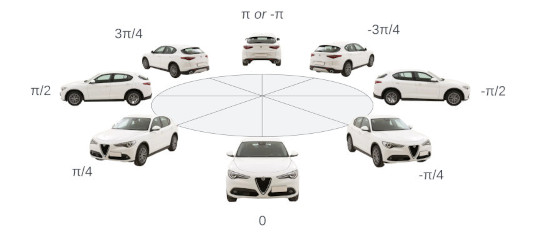
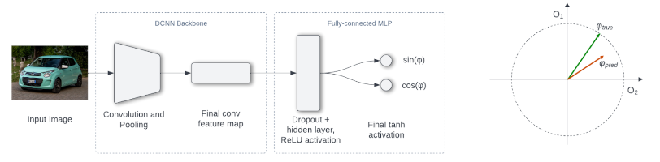
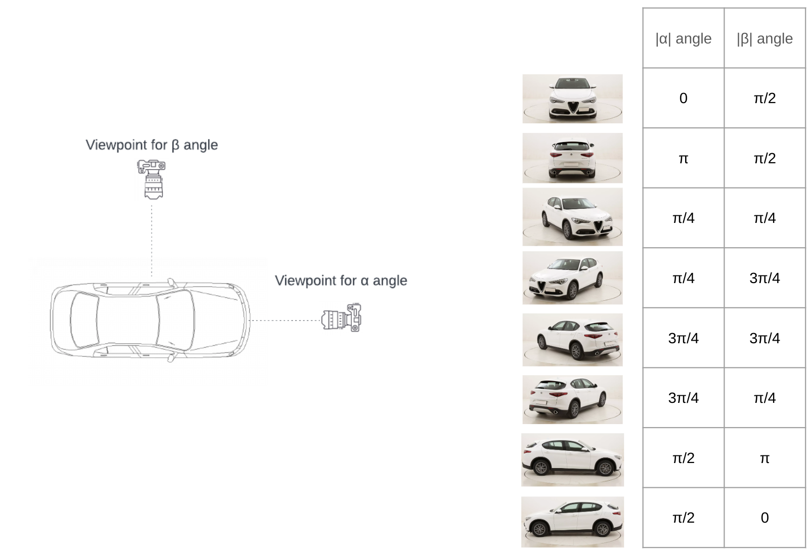
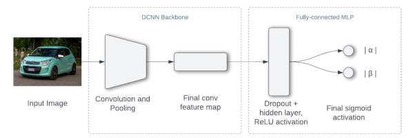

# Vehicle Pose Estimation

This model implements the paper ["Vehicle Pose Estimation: Exploring Angular Representations"](https://www.scitepress.org/Link.aspx?doi=10.5220/0012574300003660) by Orlov, I.; Buzzelli, M. and Schettini, R. (2024) in _Proceedings of the 19th International Joint Conference on Computer Vision, Imaging and Computer Graphics Theory and Applications - Volume 2: VISAPP_; ISBN 978-989-758-679-8; ISSN 2184-4321, SciTePress, pages 853-860

[](https://www.scitepress.org/Papers/2024/125743/125743.pdf) [](https://doi.org/10.5220/0012574300003660)

Our research utilizes the PASCAL3D+ dataset, which offers a diverse range of object categories, including cars,  with annotated azimuth estimations for each photograph. We introduce two architectures that approach azimuth estimation as a regression problem, each employing a deep convolutional neural network (DCNN) backbone but diverging in their output definition strategies.



## Problem definition

The azimuth, ( φ ), is defined as the angle in the range [-π, π] that represents the orientation of a vehicle with respect to the viewer. Originating from the front of the car, this angle describes how much the vehicle has rotated from this frontal viewpoint. For instance, ( φ = 0 ) would indicate a car directly facing the viewer, while ( φ = π/2 ) would signify the car turned 90° to the right. This definition is depicted below.



## Dataset

We use [Pascal 3D+ dataset v.1.1](https://cvgl.stanford.edu/projects/pascal3d.html) to train the model. We take only ImageNet images subset.

## Algorithm

We tired two different approaches to formalize the output of the model, since we cannot return only one variable because of the polar coordinates nature (π and -π predictions should have 0 distance, not 2π).

### Approach 1: Sin & Cos representation

* We output *o1=sin(φ)* & *o2=cos(φ)* of the predicted azimuth using tanh activation;
* Recover φ pred := atan2(o1, o2);
* Loss function: MSE



### Approach 2: Directional discriminators

We Split the angle prediction into two discriminators:
* Front/Rear “classifier”
* Left/Right “classifier”

So we define two angles α & β as shown below



*NB. The paper contains few mistakes in the values of β of corresponding figure, so we corrected them in the image above.*

Model returns two outputs, which are absolute values of α & β.

* Final activation: two sigmoids, which correspond to two normalized angles α & β;
* Loss function: sum of two binary cross-entropy loss for the α & β predictions;



## Evaluation

To evaluate the performance of the models:

1. We recover the predicted φ angle
2. Realign φpred to φtrue if needed and calculate the minimum angle between those

The metrics we use:

* Mean Absolute Error (in degrees)
* Rooted Mean Squared Error (in degrees)
* Median Absolute Error (in degrees)
* R2 score
* Accuracy π/6: The fraction of instances whose predicted viewpoint is within a π/6 threshold of the target viewpoint


## Scripts

### Local setup

Requirements:

* Python 3.8
* Tensorflow 2.8

For local setup, run:

```bash
conda create -n car-pose-estimation python=3.8 poetry -y
conda activate car-pose-estimation
poetry install --with dev
```

#### Dataset preparation 

To generate the dataset from original Pascal 3D+ dataset zip file, run:

```bash
poetry run python scripts/prepare_dataset.py
```

#### Model training

To train the model, run:

```bash
poetry run python scripts/train_model.py
```

#### Validation

To validate the model, run:

```bash
poetry run python scripts/validate_model.py
```

### Inference

To run inference on a folder of images, run:

```bash
poetry run python scripts/inference.py --model_path=model_file.h5 --approach=2 --images_path=tests/sample_images --output_path=./samples_results.json
```

To create the visualization of the results, add the `--visualizations_path=./samples_visualization` argument.

Check the source of the `scripts/inference.py` for more details on the arguments.
