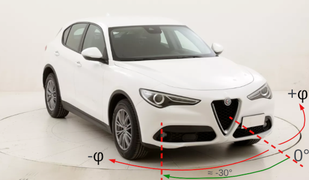
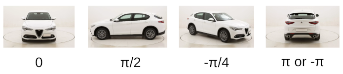
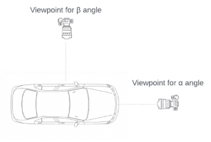
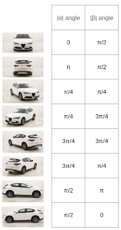

# Car azimuth predictor

This model predicts the azimuth of vehicle on the photograph.

## Problem definition

* We define azimuth as φ, the angle in the interval [-π, π] counting from the front of the car;
* We ignore elevation, distance, cyclorotation and other viewpoint characteristics;

Few examples:

## Dataset

We use [Pascal 3D+ dataset](https://cvgl.stanford.edu/projects/pascal3d.html) to train the model, release 1.1. We take only ImageNet images subset.

## Algorithm

We tired two different approaches to formalize the output of the model, since we cannot return only one variable because of the polar coordinates nature (π and -π predictions should have 0 distance, not 2π).

## Approach A

* We output *o1=sin(φ)* & *o2=cos(φ)* of the predicted azimuth using tanh activation;
* Recover φ pred := atan2(o1, o2);
* Loss function: MSE

## Approach B

We Split the angle prediction into two discriminators:
* Front/Rear “classifier”
* Left/Right “classifier”

So we define two angles α & β as shown below

Model returns two outputs, which are absolute values of α & β.

Few examples of the values of α & β

* Final activation: two sigmoids, which correspond to two normalized angles α & β;
* Loss function: sum of two binary cross-entropy loss for the α & β predictions;

## Evaluation

To evaluate the performance of the models:

1. We recover the predicted φ angle
2. Realign φpred to φtrue if needed and calculate the minimum angle between those

The metrics we use:

* Mean Absolute Error (in degrees)
* Rooted Mean Squared Error (in degrees)
* Median Absolute Error (in degrees)
* R2 score
* Accuracy π/6: The fraction of instances whose predicted viewpoint is within a π/6 threshold of the target viewpoint
